# 2.保护模式内存管理 

## 2.1 内存管理概览 

### 2.1.1 内存寻址

80X86 支持多种数据类型：1 字节、2 字节（1 个字）或 4 字节（双字或长字）的无符号整型数或带符号整型数，以及多字节字符串等。通常字节中某一比特位的定位或寻址可以基于字节来寻址，因此最小数据类型的寻址是对 1 字节数据（数值或字符）的定位。

通常内存地址从 0 开始编址，并且为**小端存放**。80X86 CPU 来说，其地址总线宽度为 32 位，因此一共有 2^32 个不同物理地址。即内存物理地址空间有 4G，总共可以寻址 4G 字节的物理内存。

为进行内存寻址，80X86采用**段（segment）**的寻址技术。这种寻址技术把内存空间分成一个或多个称为段的线性区域，从而对内存中一个数据对象的寻址就需要使用一个段的**起始地址**（即段地址）和一个**段内偏移地址**两部分构成。

> 段地址：使用 16 位的段选择符指定，其中 14 位可以选择 2^14 次方即 16384 个段。
> 段内偏移地址：使用 32 位的值来指定，因此段内地址可以是 0 到 4G。

* 逻辑地址 Logical Address：程序中由 16 位的段和 32 位的偏移构成的 48 位地址或长指针称为一个逻辑地址（虚拟地址）。它唯一确定了一个数据对象的段地址和段内偏移地址。

> 80X86 为段部分提供了 6 个存放段选择符的段寄存器：CS、DS、ES、SS、FS 和 GS。
>
> * CS： 用于寻址当前代码段。在任何指定时刻由 CS 寻址的段称为当前代码段。此时 EIP 寄存器中包含了当前代码段内下一条要执行指令的段内偏移地址。因此要执行指令的地址可表示成CS:[EIP]。段间控制转移指令可以被用来为 CS 和 EIP 赋予新值，从而可以把执行位置改变到其他的代码段中，这样就实现了在不同段中程序的控制传递。
> * SS： 寻址堆栈段。
>   由段寄存器SS寻址的段称为当前堆栈段。栈顶由ESP寄存器内容指定。因此堆栈顶处地址是SS:[ESP]。
> * 另外 4 个段寄存器是通用段寄存器。当指令中没有指定所操作数据的段时，那么 DS 将是默认的数据段寄存器。

80X86指令规定了计算偏移量的很多方式，称为**指令寻址方式**。指令的偏移量由三部分相加组成：基地址寄存器、变址寄存器和一个偏移常量。即：**偏移地址 = 基地址 + （变址 x 比例因子） + 偏移量**。

### 2.1.2 地址变换

任何完整的内存管理系统都包含两个关键部分：**保护**和**地址变换**。保护是防止可以防止一个任务访问另一个任务或操作系统的内存区域。可以让某些**物理地址**不被任何**逻辑地址**所映射，所以在地址变换过程中同时也提供了内存保护功能。

**分段机制**和**分页机制**是两种广泛使用的地址变换技术，它们的不同之处在于逻辑地址是如何组织成被映射的内存块、变换信息如何指定以及编程人员如何进行操作。80X86 在从逻辑地址到物理地址变换过程中使用了这两种机制，第一阶段使用分段机制把程序的逻辑地址变换成处理器可寻址内存空间（称为**线性地址空间**）中的地址。第二阶段使用分页机制把线性地址转换为**物理地址**。第一阶段的分段变换机制必用，而第二阶段的分页机制则是可选的。

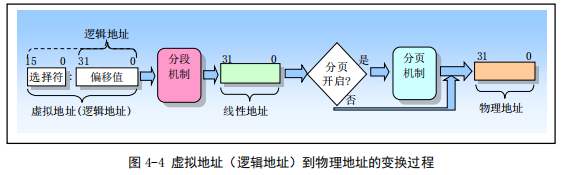

* 分段机制：分段提供了一种机制，用于把处理器可寻址的线性地址空间划分成一些较小的称为段的受保护地址空间区域。段可以用来存放程序的代码、数据和堆栈，或者系统数据结构（例如 TSS或 LDT）。如果处理器中有多个程序或任务在运行，那么每个程序可分配各自的一套段。此时处理器就可以加强这些段之间的界限，并且确保一个程序不会通过访问另一个程序的段而干扰程序的执行。

  **逻辑地址包括一个段选择符和一个偏移量。段选择符是一个段的唯一标识。段选择符提供了段描述符表（例如全局描述符表 GDT）中一个数据结构（称为段描述符）的偏移量。每个段都有一个段描述符。段描述符指明段的大小、访问权限和段的特权级、段类型以及段的第 1 个字节在线性地址空间中的位置（称为段的基址）。**

  虚拟地址（逻辑地址）空间可包含最多 16K 的段，而每个段最长可达 4GB，使得虚拟地址空间容量达到 64 TB（2^46）。线性地址空间和物理地址空间都是 4GB（2^32）。实际上，如果禁用分页机制，那么线性地址空间就是物理地址空间。

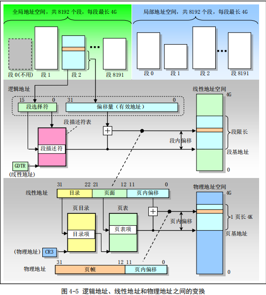

* 分页机制

  因为多任务系统通常定义的线性地址空间都要比其含有的物理内存容量大得多，所以需要使用虚拟存储技术。分页机制支持虚拟存储技术。在使用虚拟存储的环境中，大容量的线性地址空间需要使用小块的物理内存（RAM 或 ROM）以及某些外部存储空间（例如大容量硬盘）来模拟。

  当使用分页时，每个段被划分成页面（通常每页为 4KB 大小），页面会被存储于物理内存中或硬盘上。操作系统通过维护一个页目录和一些页表来留意这些页面。当程序（或任务）试图访问线性地址空间中的一个地址位置时，处理器就会使用页目录和页表把线性地址转换成一个物理地址，然后在该内存位置上执行所要求的操作（读或写）。如果当前被访问的页面不在物理内存中，处理器就会中断程序的执行（通过产生一个页错误异常）。然后操作系统就可以从硬盘上把该页面读入物理内存中，并继续执行刚才被中断的程序。

实际上，段表存储在线性地址空间，而页表则保存在物理地址空间。因而段变换表可由分页机制重新定位而无需段机制的信息或合作。段变换机制把虚拟地址（逻辑地址）变换成线性地址，并且在线性地址空间中访问自己的表，但是并不知晓分页机制把这些线性地址转换到物理地址的过程。类似地，分页机制也不知道程序产生地址的虚拟地址空间。分页机制只是简单地把线性地址转换成物理地址，并且在物理内存中访问自己的转换表。

## 2.2 内存分段机制

IA-32 架构的分段机制，使得系统构造和程序执行有了更多的灵活性和稳定性。

***

1. Basic Flat Model - 基本扁平模型

   基础扁平模型，是一个操作系统中最简单的内存模型。在这种模型中，操作系统和应用程序 都可以访问到连续、无分段的内存地址空间。这种模型在最大限度上向系统设计和程序开发者隐藏了体系结构中内存的分段机制。

   实现基本扁平模型，至少需要创建两个段描述符，一个指向内存代码段，一个指向内存地址段。但是两个内存段都会被映射到同一个线性地址空间，因此，两个段描述符的初始基址相同（都为内存0地址），且两个段描述符的段限制也相同，均为4GB（32位体系结构）。因为段限制机制，分段机制不会为超出实际物理内存地址的地址引用抛出异常。

   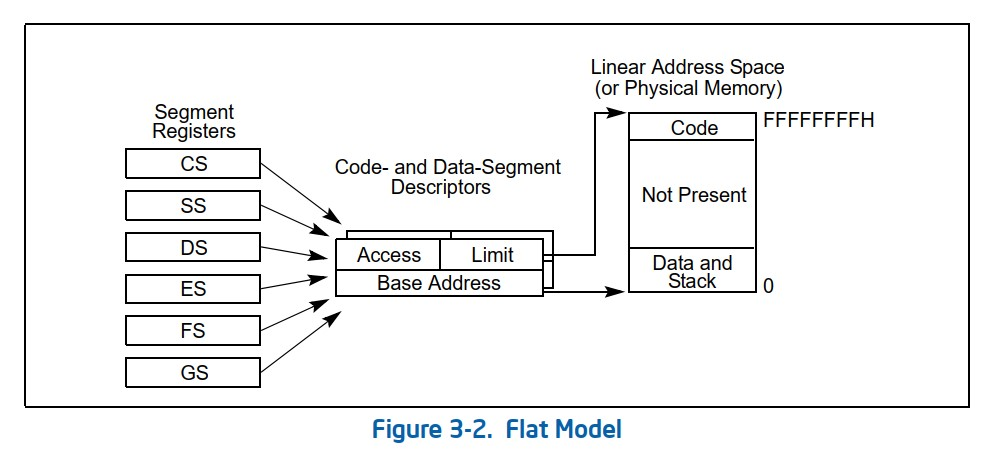

   `ROM(EPROM)` 通常位于实际物理地址空间的顶部，因为处理器通常在地址`FFFF_FFF0H`处开始执行。`RAM(DRAM)`通常在物理地址的底部，因为复位初始化后，`DS数据段`的初始基地址为0。

***

2. Protected Flat Model - 保护模式扁平模型

   保护模式扁平模型和基本扁平模型很相似，只不过段限制被设置为物理内存实际存在的地址范围（可能不足4GB）。如果试图访问不存在的线性物理地址，则会生成一般保护异常（GP）。此模型提供了针对应用程序错误的最低级别的保护。

   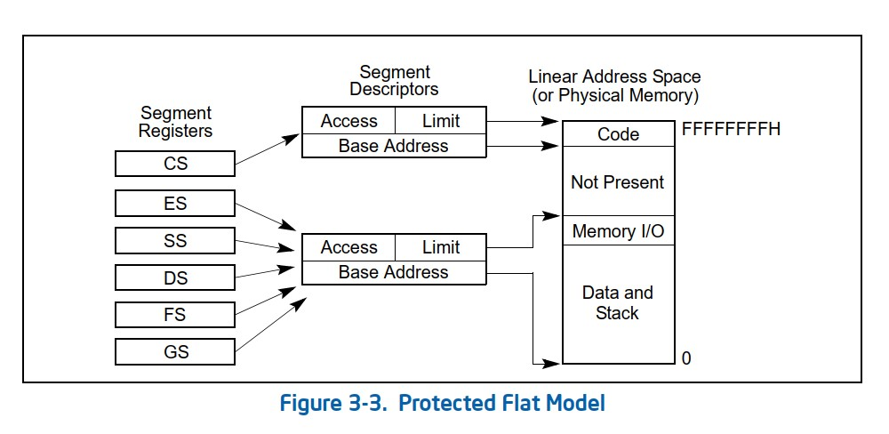

   保护模式扁平模型添加了更多的复杂特性去提供更好的系统保护措施。例如，对用户和系统的代码段和数据段提供隔离的分页机制。这种机制总共定义了四种段，用户应用程序等级为3的代码段和数据段，操作系统级别为0的代码段和数据段。他们都是从线性地址为0的位置开始重叠交错的存储在一起。

   这种简单的分页结构，可以保护操作系统不受应用程序的影响。通过对每个应用程序建立相同的分页结构，还可以使得各个应用程序之间互相不受到影响。一些流行的多任务处理器就采用了这种设计。

***

3. Multi-Segment Model - 多分段模型

   多分段模型发挥了分段机制的全部特性，为代码，数据结构，程序，任务提供了硬件结构上的强制保护。在这种机制中，每个应用程序或者任务都有自己的`段描述符表`和`段`。这些段既可以作为该应用程序的私有段，也可以在程序之间共享。对系统上所有独立运行程序的段和执行环境的访问，完全由硬件控制。

   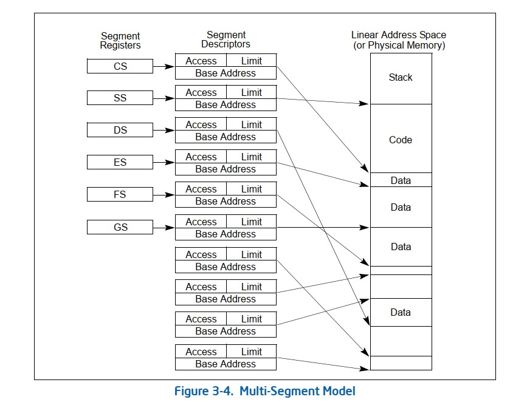

   由硬件控制的访问检查，既可以防止内存应用超过段的限制，又可以防止程序在某些段中执行不允许的操作。例如：如果某一代码段被设置为只读段，则我们就可以通过硬件来防止此代码段的写入。而段所拥有的的访问权限信息，可以用于设置保护级别，保护级别可以保护操作系统过程免受应用程序未经允许的访问。

***

4. 其他

   在Intel 64体系结构的IA-32e模式下，分段的效果取决于处理器是在兼容模式下运行还是在64位模式下运行。在兼容模式下，分段功能与使用传统16位或32位保护模式语义一样。

   在64位模式下，通常（但不是完全）禁用分段，从而创建一个平坦的64位线性地址空间。处理器将CS、DS、ES、SS的段基视为零，创建一个等于有效地址的线性地址。FS和GS段是例外。在线性地址计算中，这些段寄存器（保存段基址）可以用作附加基址寄存器。它们有助于处理本地数据和某些操作系统数据结构。

   分页可以与图3-2、3-3和3-4中描述的任何分段模型一起使用。处理器的分页机制将线性地址空间（将段映射到其中）划分为页（如图3-1所示）。然后，这些线性地址空间页映射到物理地址空间中的页。分页机制提供了多个页级保护设施，可以与段保护设施一起使用，也可以替代段保护设施。例如，它允许逐页实施读写保护。分页机制还提供了两级用户主管保护，也可以逐页指定。

    
   
    
   
   
   
   

##    2.3逻辑地址和线性地址的转换

###  2.3.1 段选择子（Segment Selectors）

段选择子是一个对于段的识别符，它由16位二进制数组成，结构如下图所示。
  

    

  

它并不直接指向段，而是指向定义段的段描述子。这16位中包含以下组成部分：

- 索引值（Index）：位3 ~ 位15，从8192（2的13次方）个 GDT 或 LDT 的描述子中选择其一。处理器将索引值乘以8（段描述符中的字节数），然后将结果加到 GDT 或 LDT 的基地址（分别来自 GDTR 或 LDTR 寄存器）。
- TI标志（table indicator flag，表指示标志）：位2，指明使用哪一个描述符表，置 0 则为 GDT，置 1 则为 LDT。
- 要求的特权等级（RPL）：位0 和 位1，标明选择子的特权等级，取值范围为0 ~ 3，其中等级 0 特权最高。GDT 的第一个条目未被处理器使用。指向 GDT 此项的段选择器（即，索引为 0 且 TI 标志设置为 0 的段选择器）用作“空段选择器”。当段寄存器（CS或SS寄存器除外）加载了空选择器时，处理器不会产生异常。但是，当使用包含空选择器的段寄存器访问内存时，它确实会产生异常。空选择器可用于初始化未使用的段寄存器。使用空段选择器加载CS或SS寄存器会导致生成一般保护异常（#GP）。段选择器作为指针变量的一部分对应用程序可见，但是选择器的值通常是由链接编辑器或链接加载程序而不是应用程序分配或修改的。

### 2.3.2 段寄存器（Segment Registers）

处理器提供了6个用于保存段选择子的寄存器，他们分别是代码段寄存器（CS）、数据段寄存器（DS）、堆栈段寄存器（SS）以及三个附加的数据段寄存器（ES，FS和GS）。它们可以减少地址转换时间和编码复杂度，如下图所示。
  

    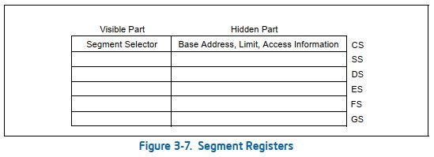

  

这些段寄存器中的每一个都支持一种特定类型的内存引用（代码，堆栈或数据）。对于绝大多数的程序执行，至少CS段，DS段和SS段寄存器必须装入有效的段选择器。而附加的数据段寄存器可以用于使附加数据段用于当前执行程序。为了使程序访问段，段的段选择器必须已加载到段寄存器之一中。因此，尽管系统可以定义数千个段，但只有6个段可立即使用。通过在程序执行期间将其他段的选择器加载到这些寄存器中，可以使其他段可用。
  
每个段寄存器都有一个“可见”部分和一个“隐藏”部分。 （隐藏的部分有时被称为“描述符缓存”或“影子寄存器”。）将段选择器加载到段寄存器的可见部分时，处理器还会使用以下内容加载段寄存器的隐藏部分：段选择器指向的段描述符的基址，段限制和访问控制信息。存储在段寄存器中的信息（可见和隐藏）允许处理器转换地址，而无需花费额外的总线周期从段描述符读取基地址和限制。在多个处理器可以访问同一描述符表的系统中，修改描述符表后，软件有责任重新加载段寄存器。如果不这样做，则在修改其内存驻留版本后，可能会使用缓存在段寄存器中的旧段描述符。
  
提供了两种用于加载段寄存器的加载指令：

- 1、直接加载指令，例如MOV，POP，LDS，LES，LSS，LGS和LFS指令。这些指令明确引用了段寄存器。
- 2、隐含的加载指令，例如CALL，JMP和RET指令的远指针版本，SYSENTER和SYSEXIT指令以及IRET，INTn，INTO和INT3指令。这些指令将CS寄存器（有时是其他段寄存器）的内容作为其操作的附带部分进行更改。
- 此外，MOV指令还可用于将段寄存器的可见部分存储在通用寄存器中。

### 2.3.3 段描述子（Segment Descriptors）

段描述子是GDT或LDT中的数据结构，可为处理器提供段的大小和位置以及访问控制和状态信息。段描述符通常由编译器、链接器、加载器或操作系统或执行程序创建，而不由应用程序创建。下面的图3-8说明了所有类型段描述符的通用格式。
  

    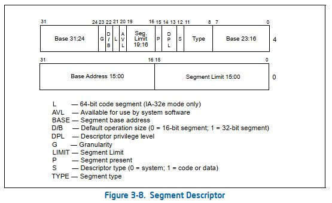

  

下面是对于段描述子的一些标志位及字段的解释说明：

- 段限制字段（高32位的位19~位16 + 低32位的位15~0）：
   
  指定段的大小。处理器将两个段限制字段放在一起以形成20位值。处理器会根据G标志（粒度标志）的设置，通过以下两种方式之一来解释段限制：（1）如果粒度标志置0，则段大小的范围可以从1字节到1MB，以字节为增量。（2）如果粒度标志置1，则段大小的范围为4KB至4GB，增量为4KB。处理器根据段是向上扩展段还是向下扩展段，以两种不同方式使用段限制。有关段类型的更多信息，请参见第3.4.5.1节“代码段和数据段描述符类型”。对于扩展段，逻辑地址中的偏移范围可以从0到段限制。大于段限制的偏移量会生成一般保护异常（对于除SS以外的所有段，为#GP）或堆栈故障异常（对于SS段为#SS）。对于扩展细分，细分限制具有反向功能；偏移量可以在段限制加1到FFFFFFFFH或FFFFH之间，具体取决于B标志的设置。小于或等于段限制的偏移量会生成常规保护异常或堆栈故障异常。减小扩展段的段限制字段中的值会在段地址空间的底部而不是顶部分配新的内存。IA-32体系结构堆栈始终向下增长，从而使该机制便于扩展堆栈。

- 基地址字段（高32位的位31~位24、位7~位0 + 低32位的位31~位16）：
   
  定义段的字节0在4GB线性地址空间内的位置。处理器将三个基地址字段放在一起以形成单个32位值。段基址应与16字节边界对齐。尽管不需要16字节对齐，但是此对齐允许程序通过在16字节边界上对齐代码和数据来最大化性能。

- 类型字段（高32位的位11~8）：
   
  该字段指示分段或门的类型，并指定可以对分段进行访问的类型以及增长方向。该字段的解释取决于描述符类型标志是指定应用程序（代码还是数据）描述符还是系统描述符。对于代码、数据和系统描述符，type字段的编码不同（如下图所示）。
    

    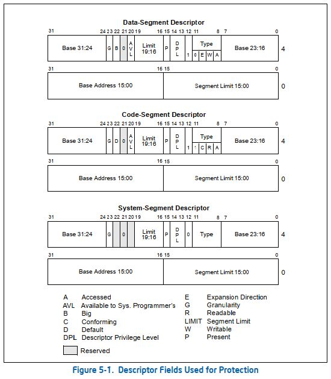

- S标志（描述符类型标志，高32位的第12位）：
   
  指定段描述符是用于系统段（S标志置为0）还是代码或数据段（S标志置为1）。

- DPL字段（描述符特权级别字段，高32位的位14~位13）:
   
  指定段的特权级别。特权级别的范围可以从0到3，其中0是最高特权级别。 DPL用于控制对网段的访问。

- P标志（段存在标志，高32位的第15位）：
   
  指示该段是存在于内存中（P标志置为1）还是不存在（P标志置为0）。如果清除此标志，则当将指向段描述符的段选择器加载到段寄存器中时，处理器会生成不存在段异常（#NP）。内存管理软件可以使用此标志来控制在给定时间将哪些段实际加载到物理内存中。除了分页之外，它还提供了用于管理虚拟内存的控件。下面图3-9显示了清除存在段标志时的段描述符格式。清除此标志后，操作系统或执行人员可以自由使用标记为“可用”的位置来存储自己的数据，例如有关丢失段的下落的信息。
    

    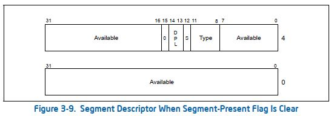

- D/B标志（默认操作大小/默认堆栈指针大小和/或上限标志，高32位的第22位）：
   
  根据段描述符是可执行代码段，扩展数据段还是堆栈段，执行不同的功能。（对于32位代码和数据段，此标志应始终设置为1；对于16位代码和数据段，应始终将其设置为0。）
   
  可执行代码段：该标志称为D标志，它指示段中指令引用的有效地址和操作数的默认长度。如果设置了该标志，则假定使用32位地址和32位或8位操作数；否则，将使用默认值。如果清楚，则假定使用16位地址和16位或8位操作数。指令前缀66H可以用于选择默认值以外的操作数大小，而前缀67H可以用于选择默认值以外的地址大小。
   
  堆栈段（SS寄存器指向的数据段）：该标志称为B（大）标志，它指定用于隐式堆栈操作（例如推入，弹出和调用）的堆栈指针的大小。如果设置了该标志，则使用32位堆栈指针，该指针存储在32位ESP寄存器中。如果清除该标志，则使用16位堆栈指针，该指针存储在16位SP寄存器中。如果将堆栈段设置为扩展数据段（在下一段中描述），则B标志还将指定堆栈段的上限。
   
  向下扩展数据段：该标志称为B标志，它指定段的上限。如果设置了该标志，则上限为FFFFFFFFH（4 GB）；如果清除该标志，则上限为FFFFH（64 KB）。

- G标志（粒度标志，高32位的第23位）：
   
  确定细分限制字段的缩放比例。当清除粒度标志时，段限制以字节为单位进行解释；当设置标志时，段限制以4 KB单位解释。（此标志不会影响基址的粒度；它始终是字节粒度的。）设置了粒度标志时，在根据段限制检查偏移量时，不会测试偏移量的十二个最低有效位。例如，当设置了粒度标志时，限制为0会导致从0到4095的有效偏移量。

- L标志（64位代码段标志，高32位的第21位）：
   
  在IA-32e模式下，段描述符的第二个双字的位21指示代码段是否包含本机64位代码。值为1表示此代码段中的指令以64位模式执行。值为0表示此代码段中的指令在兼容模式下执行。如果设置了L位，则必须清除D位。如果不在IA-32e模式下或对于非代码段，则保留位21，并且应始终将其设置为0。

- 可用和保留位（AVL，高32位的第20位）：
   
  段描述符的第二个双字的第20位可供系统软件使用。
## 2.4 描述符的分类
#### 一、段描述符的分类

#### 二、段描述符的通用格式[1]

段描述符是GDT和LDT中的一个数据结构项，用于向处理器提供有关一个段的位置、大小以及访问控制的状态信息。每个段描述符的长度是8个字节，含有3个主要字段：

- 段基地址
- 段限长
- 段属性

段描述符通常由编译器，链接器，加载器或者操作系统来创建，但绝不是应用程序。

下图给出了所有类型的段描述符的一般形式。

##### 1.段限长字段Limit

用于指定段的长度。处理器会把段描述符中两个段限长字段组合成一个20位的值，并根据颗粒度标志G来指定段限长Limit值的实际含义。

如果G=0，则Limit值的单位是B，也就是说Limit的范围可以是1B到1MB；

如果G=1，则Limit值的单位是4KB，也就是说Limit的范围可以是4KB到4GB。

根据段类型字段TYPE中的段扩展方向标志E，处理器可以以两种不同的方式使用Limit。

E=0：表示向上扩展的段（简称上扩段），逻辑地址中的偏移值范围可以从0到Limit；

E=1：表示向下扩展的段（简称下扩段），逻辑地址中的偏移范围可以从Limit到0xFFFF（当B=0时）或者0xFFFF_FFFF（当B=1时）。

###### 2.基地址字段Base

该字段定义在4GB线性地址空间中一个段的字节0所处的位置。也许你觉得这句话不好理解，我们换一种说法：对于一个逻辑地址，如果段内偏移为0，那么这个逻辑地址对应的线性地址就是Base；如果段内偏移为X，那么这个逻辑地址对应的线性地址就是Base+X；

段基地址可以是0~4GB范围内的任意地址（这同实模式不同，实模式下段基地址要求16字节对齐），但是，为了让程序具有最佳性能，还是建议段基地址对齐16字节边界。

##### 3.段类型字段TYPE

该字段用于指定段或者门（Gate）的类型、说明段的访问种类以及段的扩展方向。该字段的解释依赖于描述符类型标志S；TYPE字段的编码对代码段、数据段或者系统描述符都不同。

##### 4.描述符类型标志S

S=0：表示存储段描述符。所谓“存储段”，就是存放可由程序直接进行访问的代码和数据的段。说白了，存储段就是代码段或者数据段。

S=1：表示系统描述符。

##### 5.描述符特权级字段DPL

用于指明描述符的特权级。特权级范围从0（最高）到3（最低）。DPL字段用于控制对段的访问。

##### 6.段存在标志P

用于指出一个段是在内存中（P=1）还是不在内存中（P=0）.

##### 7.D/B（默认操作数大小/默认栈指针大小和上界限）

对于代码段，此位称为“D”位；对于栈段，此位称为“B”位。

##### 8.颗粒度标志G

该字段用于确定段限长字段Limit值的单位。

如果G=0，则Limit值的单位是B；

如果G=1，则Limit值的单位是4KB；

注意：这个字段不影响段基地址的颗粒度，基地址的颗粒度总是以字节为单位。

##### 9.可用和保留位

L位（就是上图灰色的那个位）：是64位代码段标志，保留此位给64位处理器使用。目前，我们将此位置“0”即可。

AVL：是软件可以使用的位，通常由操作系统来用，处理器并不使用它。

#### 三、数据段描述符[1]

当S=1且TYPE字段的最高位（第2个双字的位11）为0时，表明是一个数据段描述符。

下图是数据段描述符的格式。

##### 1.B位（默认栈指针大小和上界限）

对于栈段（由SS寄存器指向的数据段）来说，该位用来指明隐含堆栈操作（如PUSH、POP或CALL）时的栈指针大小。

B=0：使用SP寄存器

B=1：使用ESP寄存器

同时，B的值也决定了栈的上部边界。

B=0：栈段的上部边界（也就是SP寄存器的最大值）为0xFFFF;

B=1：栈段的上部边界（也就是ESP寄存器的最大值）为0xFFFF_FFFF.

##### 2.A位（已访问）

用于表示一个段最近是否被访问过（准确地说是指明从上次操作系统清零该位后一个段是否被访问过）。

当创建描述符的时候，应该把这位清零。之后，每当该段被访问时（准确地说是处理器把这个段的段选择符加载进段寄存器时，也许你不懂这句话，没有关系，现在忽略就可以了。）它就会将该位置“1”；对该位的清零是由操作系统负责的，通过定期监视该位的状态，就可以统计出该段的使用频率。当内存空间紧张时，可以把不经常使用的段退避到硬盘上，从而实现虚拟内存管理。

##### 3.W位（可写）

指示段的读写属性。

W=0：段不允许写入，否则会引发处理器异常中断；

W=1：允许写入。

##### 4.E位（扩展方向）

E=0：表示向上扩展的段（简称上扩段），逻辑地址中的偏移值范围可以从0到Limit；

E=1：表示向下扩展的段（简称下扩段，通常是栈段），逻辑地址中的偏移范围可以从Limit到0xFFFF（当B=0时）或者0xFFFF_FFFF（当B=1时）。

#### 四、代码段描述符[1]

当S=1且TYPE字段的最高位（第2个双字的位11）为1时，表明是一个代码段描述符。

下图是代码段描述符的格式。

##### 1.D位（默认操作数大小）

用于指出该段中的指令引用有效地址和操作数的默认长度。

D=0：默认值是16位的地址和16位或者8位的操作数；

D=1：默认值是32位的地址和32位或者8位的操作数；

说明：指令前缀0x66可以用来选择非默认值的操作数大小，指令前缀0x67可以用来选择非默认值的地址大小。

##### 2.A位（已访问）

与数据段描述符中的A位相同。

##### 3.R位（可读）

R=0：代码段不可读，只能执行。

R=1：代码段可读，可执行。

也许有人会问，当R=0时，既然代码段不可读，那处理器怎么从里面取指令执行呢？事实上，这里的R属性并非针对处理器，而是用来限制程序的行为。当常数或者静态数据被放在了一个ROM中时，就可以使用一个可读可执行的代码段，然后通过使用带CS前缀的指令，就可以读取代码段中的数据。

注意：

- 在保护模式下，代码段是不可写的。
- 堆栈段必须是可读可写的数据段。

##### 4.C位（一致性）

C=0：表示非一致性代码段。这样的代码段可以被同级代码段调用，或者通过门调用；

C=1：表示一致性代码段。可以从低特权级的程序转移到该段执行（但是低特权级的程序仍然保持自身的特权级）。

注意：所有的数据段都是非一致性的，即意味着它们不能被低特权级的程序或过程访问。然而与代码段不同，数据段可以被更高特权级的程序或过程访问，而无需使用特殊的访问门。

#### 六.系统段描述符

系统段描述符中各个位的含义如下所示:

系统段描述符指向系统段(如LDT或TSS段)

#### 七.门描述符

  在保护模式下，中断描述符表（IDT）中的每个表项由8个字节组成，其中的每个表项叫做一个门描述符（Gate Descriptor）， “门”的含义是指当中断发生时必须先访问这些“门”，能够“开门”（即将要进行的处理需通过特权检查，符合设定的权限等约束）后，然后才能进入相应的处理程序。而门描述符则描述了“门”的属性（如特权级、段内偏移量等）。在IDT中，可以包含如下3种类型的系统段描述符：

* **中断门描述符（Interrupt-gate descriptor）**： 用于中断处理，其类型码为110，中断门包含了一个外设中断或故障中断的处理程序所在段的选择子和段内偏移量。当控制权通过中断门进入中断处理程序时，处理器清IF标志，即关中断，以避免嵌套中断的发生。中断门中的DPL（Descriptor Privilege Level）为0，因此用户态的进程不能访问中断门。所有的中断处理程序都由中断门激活，并全部限制在内核态。

* **陷阱门描述符（Trap-gate descriptor）**：用于系统调用，其类型码为111，与中断门类似，其唯一的区别是，控制权通过陷阱门进入处理程序时维持IF标志位不变，也就是说，不关中断。

* **任务门描述符（Task-gate descriptor）和调用门描述符（Call-gate descriptor）**: 这两种主要是Intel设置的“任务”切换的手段。
当段描述符中的S（描述符类型）标志清零时，描述符类型为系统描述符的处理器识别以下类型的系统描述符：

+ 本地描述符表（LDT）段描述符。
+ 任务状态段（TSS）描述符。
+ 呼叫门描述符。
+ 中断门描述符。
+ 陷阱门描述符。
+ 任务门描述符。
  

这些描述符类型分为两类：系统段描述符和门描述符。 系统段描述符指向系统段（LDT和TSS段）。 门描述符本身“门”，用于保存指向代码段（调用，中断和陷阱门）中过程入口的指针，或者保留用于TSS（任务门）的细分选择器。

下表显示了系统段描述符和门描述符的type字段的编码。 
注意：IA-32e模式下的系统描述符是16个字节，而不是8个字节。

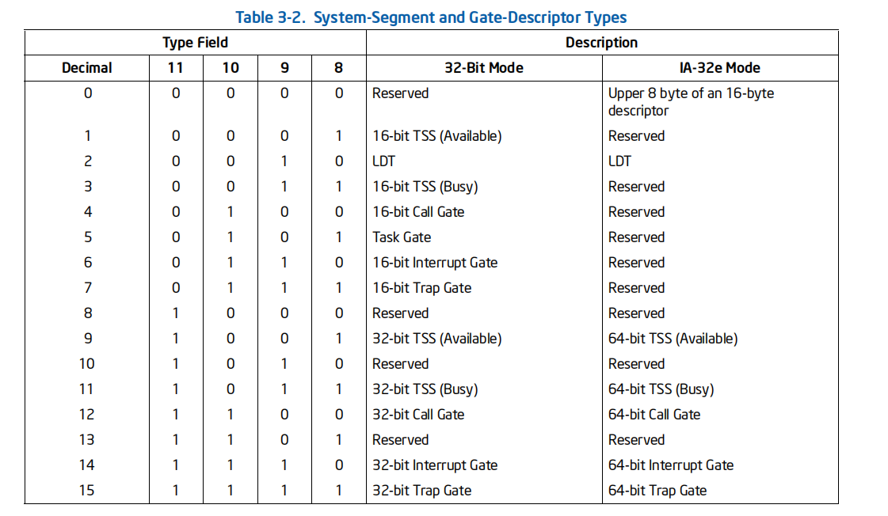

描述符表最多可包含8192（213）个8字节描述符。描述符表有两种：
+ 全局描述符表（GDT）
+ 本地描述符表（LDT）
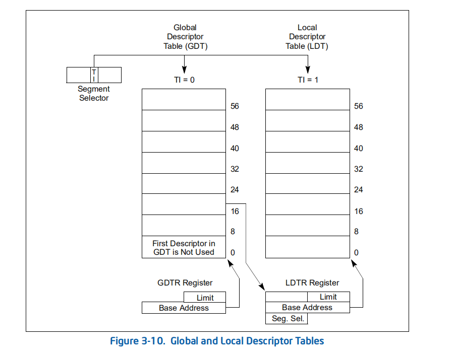

系统段和门描述符类型
每个系统必须定义一个GDT，该GDT可以用于系统中的所有程序和任务。 
可以定义一个或多个LDT。例如，可以为每个正在运行的单独任务定义LDT，或者为某些任务定义所有任务可以共享相同的LDT。

GDT本身不是一个部门。相反，它是线性地址空间中的数据结构基本线性地址和。
GDT的基址应在8字节的边界上对齐，以产生最佳的处理器性能。
GDT的限值以字节表示。与段一样，将限制值添加到基址中获取最后一个有效字节的地址。极限值为0时，恰好一个有效字节。由于段说明符始终为8个字节长，因此GDT限制应始终小于8的整数倍（即8N– 1）。
GDT中的第一个描述符未被处理器使用。此“空描述符”的段选择器不
加载到数据段寄存器（DS，ES，FS或GS）时会生成异常，但始终会生成
尝试使用描述符访问内存时的一般保护异常（#GP）。通过初始化使用该段选择器的段寄存器，可以确保意外引用未使用的段寄存器以生成异常。
LDT位于LDT类型的系统段中。 GDT必须包含LDT的段描述符分割。如果系统支持多个LDT，则每个LDT必须具有单独的段选择器和段GDT中的描述符。 
LDT的段描述符可以位于GDT中的任何位置。

#### 调用门描述符 Call-gate descriptor

1. 调用门描述符的格式
调用门用于在不同特权级之间实现受控的程序控制转移，通常仅用于使用特权级保护机制的操作系统中。本质上，它只是一个描述符，一个不同于代码段和数据段的描述符，可以安装在GDT或者LGT中，但是不能安装在IDT（中断描述符表）中。
注意：Linux Kernel 0.12 中并没有用到调用门。

上图就是调用门描述符的格式（图片来自赵炯的《Linux内核完全剖析》）。

调用门描述符给出了代码段的选择子，有了段选择子，就可以访问GDT或者LDT得到代码段的基地址。
调用门描述符中给出了偏移量，因此通过调用门进行控制转移时，不使用指令中给出的偏移量。
TYPE字段用于标识门的类型，1100表示调用门。
描述符中的P位是有效位，通常是1。当它为0时，调用这样的门会导致处理器产生异常。
DPL字段指明调用门的特权级，从而指定通过调用门访问特定过程所要求的特权级。
参数个数字段指明在发生堆栈切换时从调用者堆栈复制到新堆栈中的参数个数。
2. 门调用的操作过程
门调用的操作过程如下图所示（图片来自赵炯的《Linux内核完全剖析》）。

为了访问调用门，我们需要为CALL或者JMP指令的操作数提供一个远指针。该指针中的选择子用于指定调用门，而指针中的偏移值虽然需要，但是CPU不会使用它。该偏移值可以设置为任意值。当处理器访问调用门时，它会使用调用门中的段选择子来定位目标代码段的段描述符。然后CPU会把代码段描述符中的基地址和调用门中的偏移值进行组合，形成代码段中指定程序入口点的线性地址。

3. 特权级检查规则
通过调用门进行控制转移时，CPU会检查以下字段：   
   1. 当前特权级CPL
   2. 调用指令中的调用门选择子的RPL
   3. 调用门描述符中的DPL
   4. 目标代码段描述符中的DPL
   5. 目标代码段描述符中的一致性标志C

1. 堆栈切换
如果通过调用门把控制转移到了更高特权级的非一致代码段中，那么CPL就会被设置为目标代码段的DPL值，并且会引起堆栈切换。为什么要切换堆栈呢？原因有以下几点：
1. 因为栈段的特权级必须同CPL保持一致；
2. 防止高特权级程序由于栈空间不足而崩溃；
3. 防止低特权级程序通过共享的栈有意或无意地干扰高特权级程序。

为了切换栈，每个任务除了自己的固有栈之外，还必须额外定义一套或多套栈，具体是多少取决于任务的特权级别。
0特权级的任务不需要额外的栈，因为除了从调用高特权级的例程（通常是操作系统例程）返回外，不允许将控制从特权级高的代码段转移到特权级低的代码段——操作系统不会引用可靠性比自己低的代码；1特权级的任务需要额外定义一个DPL为0的栈，以便将控制转移到0特权级时使用；2特权级的任务需要额外定义两个栈，其DPL分别为0和1；3特权级的任务最多额外定义三个栈，其DPL分别为0、1、2.

#### 中断门描述符 Interrupt-gate descriptor
保护模式下三个重要的系统表——GDT、LDT和IDT
这里主要是解释中断描述符表

中断描述符表IDT将每个异常或中断向量分别与它们的处理过程联系起来。与GDT和LDT表类似，IDT也是由8字节长描述符组成的一个数组。与GDT不同的是，表中第一项可以包含描述符。为了构成IDT表中的一个索引值，处理器把异常或中断的向量号*8。因为最多只有256个中断或异常向量，所以IDT无需包含多于256个描述符。IDT中可以含有少于256个描述符，因为只有可能发生的异常或中断才需要描述符。不过IDT中所有空描述符项应该设置其存在位标志为0。

IDT表可以驻留在线性地址空间的任何地方，处理器使用IDTR寄存器来定位IDT表的位置。这个寄存器中含有IDT表32位的基地址和16位的长度(限长)值。IDT表基地址应该对其在8字节边界上以提高处理器的访问效率。限长值是以字节为单位的IDT表的长度。

#### 陷阱门描述符 Trap-gate descriptor
在I386CPU中，除了段描述符之外还有一种描述符叫做门描述符，它们并不描述某种内存段，而是描述控制转移的入口点，也就是目标代码的门。通过这种门可以实现特权级的转变和任务的切换。门描述符主要由两部分组成：选择子、偏移地址以及DPL。门描述符共有四种：调用门描述符、任务门描述符、中断门描述符和陷阱门描述符。
一、调用门描述符
    调用门一般用在特权级的切换，存在于GDT中或者LDT中。调用门的选择子指向代码段描述符，偏移地址对应代码段中的偏移量。当jump和call指令的操作数是调用门的时候，就会跳转到对应的代码处，并发生特权级的变化，也就会发生堆栈的切换。
二、任务门描述符
    任务门一般用在任务的切换，可以存放在GDT、LDT或IDT中。任务门的选择子指向GDT中的TSS选择符，偏移地址没有意义。当jmp和Call指令的操作数是任务门的时候，就会发生任务的切换。
三、中断门和陷阱门描述符
    它们是是中断处理程序的入口，存在于IDT中。中断门和陷阱门的选择子指向代码段选择符，偏移地址是代码段中，中断处理程序的入口地址。

#### 任务门描述符 Task-gate descriptor
任务门描述符用来间接地、保护引用任务。结构如下图。任务门描述符可以放在GDT,LDT和IDT中。任务门描述符中的TSS段选择符字段指向GDT中的TSS描述符。在任务切换过程中，任务门描述符中DPL字段控制访问TSS描述符。当程序通过任务门调用和跳转到一个任务时，CPL和门选择符的RPL字段必须小于等于任务门描述符中的DPL。 

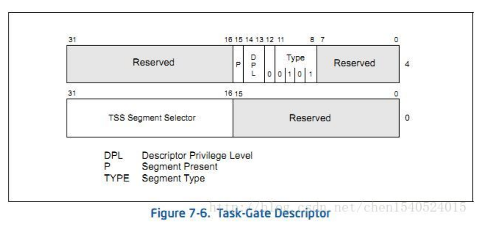

任务可以通过任务门描述符或TSS描述符被访问。LDT中任务门，GDT中的任务门和IDT中任务门可指向相同的任务，如下图： 

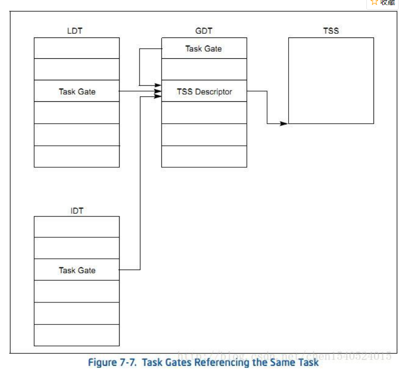

